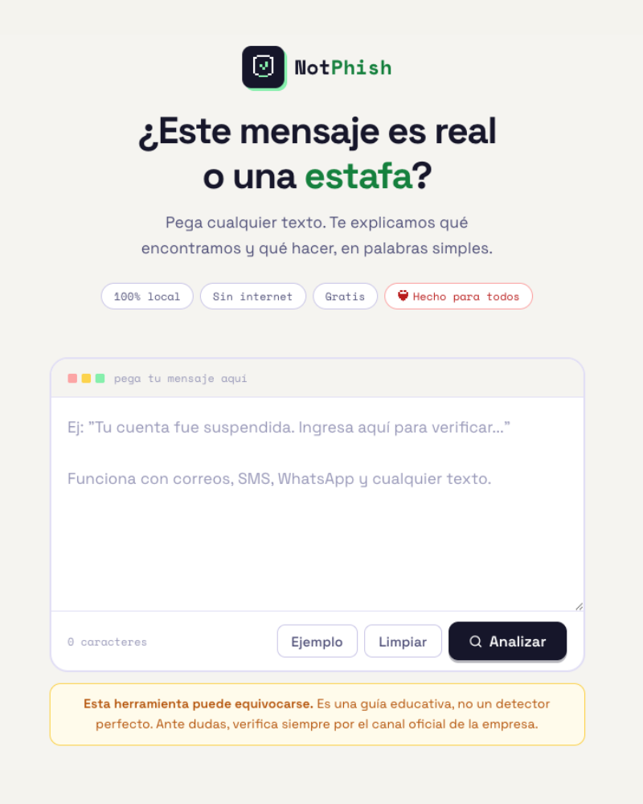
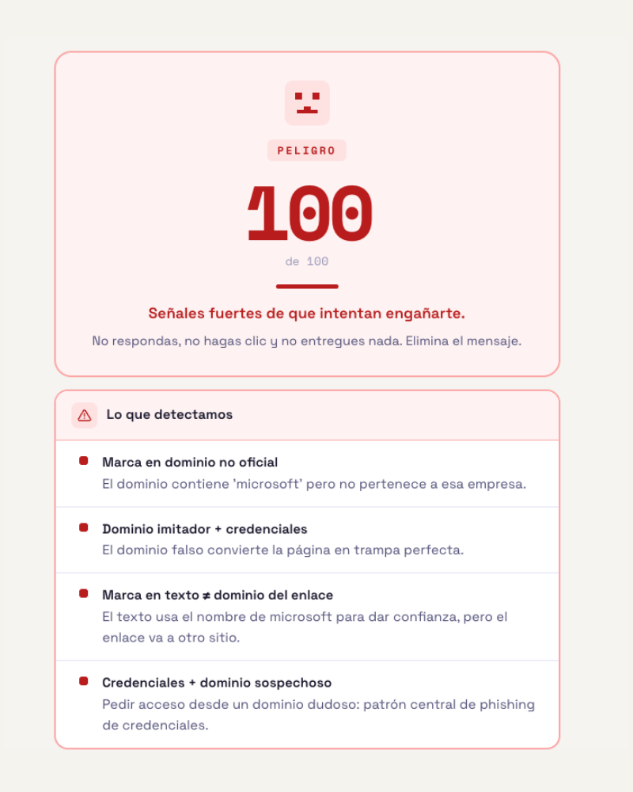
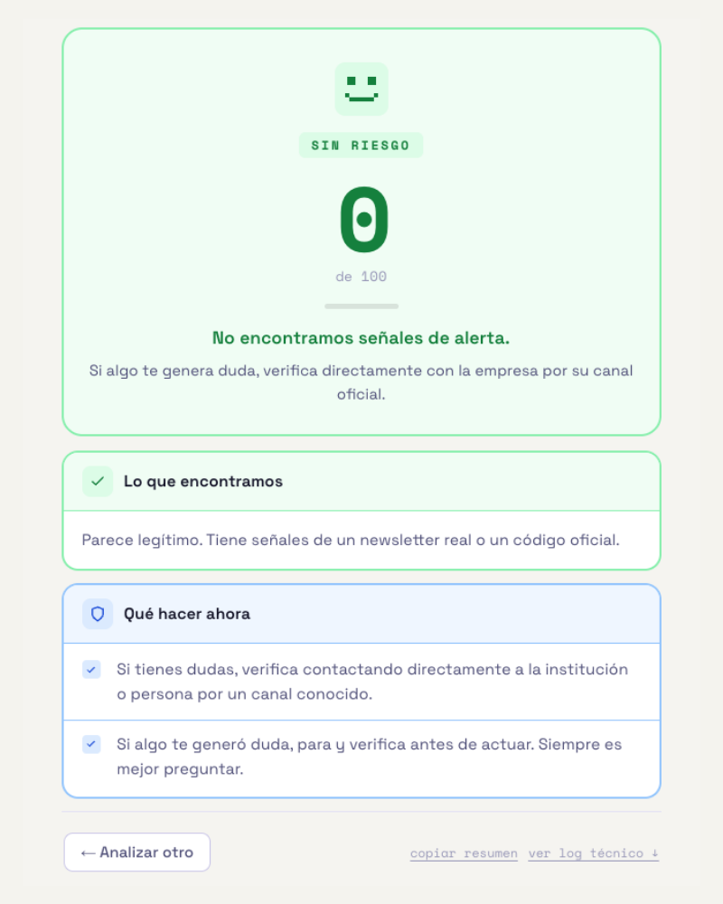

# NotPhish

Prototipo funcional de detección de phishing e ingeniería social, construido
para aprender cómo funciona la detección de amenazas desde cero.

Pega un correo, SMS o mensaje sospechoso. NotPhish analiza el texto,
explica qué señales encontró y qué hacer — en lenguaje simple,
sin tecnicismos. Diseñado pensando en personas mayores y en cualquiera
con baja alfabetización digital.

> **Esto es un prototipo de estudio, no una herramienta de seguridad profesional.**
> Lo construí para aprender. Tiene limitaciones conocidas — las documento abajo.
> Lo publico porque creo que compartir el proceso de aprendizaje
> tiene más valor que esperar a tener algo "terminado".

---

## Capturas

<p align="center">
  
  
  
</p>

---

## De dónde viene este proyecto

Este proyecto nació de una pregunta simple: ¿cómo sabe un programa
que un mensaje es una estafa?

Empecé con [`social-engineering-scanner`](https://github.com/fivur-cs/social-engineering-scanner)
— un script Bash que busca palabras clave con `grep`. Funciona para casos
obvios, pero falla con mensajes que evitan esas palabras o con correos
legítimos que las usan en contexto real.

NotPhish es el siguiente paso: misma pregunta, arquitectura más compleja,
capas de análisis distintas. Lo construí para entender por qué las reglas
simples no son suficientes y qué se necesita para ir más lejos.

---

## Qué hace

- Analiza texto libre: correos, SMS, WhatsApp, cualquier mensaje
- Detecta señales técnicas y semánticas de manipulación
- Muestra un puntaje de 0 a 100 con explicación en lenguaje simple
- Recomienda qué hacer según el nivel de riesgo
- Todo el análisis ocurre localmente — ningún texto sale de tu equipo

---

## Cómo funciona por dentro

Esta es la parte importante si eres estudiante.
NotPhish tiene tres capas que trabajan juntas.

---

### Capa 1 — Motor de reglas JavaScript (`app.js`)

Es el corazón del sistema. Analiza el texto buscando señales técnicas
concretas, no solo palabras sueltas.

**¿Qué detecta?**

- **Dominios que imitan marcas conocidas** (`banco-estado-seguro.xyz`,
  `falabella-secure.net`) — compara el dominio del enlace contra una lista
  de dominios oficiales conocidos
- **URLs acortadas** (`bit.ly`, `tinyurl`) — ocultan el destino real
- **URLs ofuscadas** (`hxxps://`) — técnica usada en reportes de phishing
  para que los filtros no detecten el enlace
- **Pedidos de OTP** — detecta cuando alguien pide que compartas
  un código que llegó a tu celular
- **Patrones de BEC** (Business Email Compromise) — el fraude del jefe:
  urgencia + silencio + transferencia de dinero
- **Señales de ingeniería social**: urgencia artificial, suplantación
  de autoridad, promesas de beneficio, amenazas de bloqueo

**¿Cómo funciona el scoring?**

Cada señal tiene un peso numérico. Algunas señales suman al score
directamente. Otras activan un "floor" mínimo — por ejemplo, si el sistema
detecta robo de OTP, el score no puede bajar de 55 aunque el texto sea corto.

El score final no es la suma de todos los pesos — se capea a 100.
Si un texto activa señales por 270 puntos, el resultado igual es 100.

**¿Qué es una señal "débil" vs una señal "dura"?**

Las señales débiles (urgencia genérica, mención de una marca, teléfono
en el texto) no se muestran solas en la interfaz — solo aparecen si hay
también señales duras. Esto evita mostrar alertas alarmantes en correos
legítimos que mencionan palabras comunes.

Las señales duras (dominio falso, pedido de OTP, fraude del jefe,
suplantación con credenciales) siempre aparecen porque indican amenaza real.

---

### Capa 2 — Modelo de machine learning (`server.py` + `models/`)

El motor de reglas es bueno detectando señales técnicas, pero no entiende
el sentido del texto. Un correo puede no tener ninguna URL sospechosa
y aun así ser una estafa escrita con mucho cuidado.

Para eso existe la capa de ML: un clasificador semántico entrenado
sobre ~46.000 textos reales.

**¿Qué tipo de modelo es?**

Un clasificador SGD (Stochastic Gradient Descent) con calibración
de probabilidades mediante `CalibratedClassifierCV`. No es una red neuronal
— es un modelo lineal eficiente, entrenado sobre representaciones TF-IDF
del texto.

**¿Qué es TF-IDF?**

Term Frequency - Inverse Document Frequency. Es una forma de representar
texto como números para que un modelo matemático pueda procesarlo.

- **TF** (frecuencia del término): qué tan seguido aparece una palabra en este texto
- **IDF** (frecuencia inversa en el corpus): qué tan rara es esa palabra
  en todos los textos del dataset

Si una palabra aparece mucho en este texto pero poco en el dataset general,
tiene peso alto. Si aparece en todos lados (como "el", "de", "que"),
tiene peso bajo. Así el modelo aprende a enfocarse en las palabras que
realmente distinguen un phishing de un correo legítimo.

**¿Word n-grams y char n-grams?**

El modelo usa dos representaciones en paralelo:

- **Word n-grams (1-2)**: analiza palabras individuales y pares de palabras.
  "expira hoy" es más revelador que "expira" o "hoy" por separado.
- **Char n-grams (3-4)**: analiza secuencias de caracteres dentro de las palabras.
  Esto captura variaciones ortográficas ("urgente", "urgentee", "urg3nte")
  y patrones morfológicos que los n-grams de palabras no ven.

**¿Qué datos de entrenamiento?**

~46.000 textos: phishing real en inglés y español, SMS scam,
correos legítimos de newsletters, marketing, transaccionales y bancarios.
El modelo aprendió a distinguir el tono y vocabulario de cada categoría.

**¿Qué devuelve?**

Una probabilidad: qué tan seguro está el modelo de que el texto es
legítimo o scam. Esa confianza es lo que usa la capa siguiente.

**Limitación importante:** el modelo fue entrenado mayoritariamente
en inglés. Su rendimiento en español, especialmente español chileno
o latinoamericano, es menor. El FPR (tasa de falsos positivos) en
correos legítimos en español es ~9.6%, versus ~2.3% en inglés.

---

### Capa 3 — Sistema híbrido (`hybrid.js`)

Esta es la decisión de diseño más interesante del proyecto.

El motor JS y el modelo ML a veces están de acuerdo y a veces no.
¿Cuándo hay que hacerle caso al ML? ¿Cuándo al JS? ¿Cuánto puede
cambiar el ML el resultado del JS?

La capa híbrida resuelve eso con un sistema de **evidence gate**:
una compuerta que decide cuánta influencia puede tener el ML
según el contexto.

**¿Cómo funciona el evidence gate?**

Evalúa el estado del análisis y clasifica en cuatro situaciones:

```
blocked   → texto muy corto, sin señales JS, sin contexto
            el ML no actúa (no hay suficiente evidencia)

partial   → hay señales de legitimidad (newsletter, OTP con aviso oficial)
            el ML solo puede bajar el score, no subirlo

semantic  → no hay señales JS técnicas, solo texto
            el ML puede dar un boost pequeño si está muy seguro (conf ≥ 0.85)

open      → hay señales JS activas
            el ML puede subir o bajar el score según su confianza
```

**¿Por qué este diseño?**

Sin el evidence gate, el ML podría subir el score de un texto corto
ambiguo como "hola, ¿cómo estás?" a nivel "Alto" solo porque su
distribución de palabras se parece superficialmente a algo en su
dataset de entrenamiento. Eso sería un falso positivo inútil.

El gate fuerza al ML a actuar solo cuando hay suficiente contexto
para que su predicción tenga sentido.

**¿Cómo se combinan los scores?**

El JS produce un score base. El ML produce una confianza (0 a 1).
Si la confianza supera el umbral (0.62 en gate=open, 0.70 en los demás),
el ML puede ajustar el score JS hacia arriba o hacia abajo,
con un descuento o boost máximo definido en `config.json`.

Hay también hard floors: si el JS detecta robo de OTP o suplantación
de dominio, el score no puede bajar de cierto umbral aunque el ML
diga que el texto parece legítimo.

---

## Por qué el score puede sumar más de 100

Si abres el log técnico en la interfaz, verás que las señales individuales
pueden sumar 270 puntos o más. El score final igual queda en 100.

Eso es correcto. El sistema no busca que todo sume exactamente 100 —
cada señal aporta su peso de forma independiente, y el resultado
se capa al máximo. Es como un examen donde puedes ganar puntos extra:
la nota igual queda en 7.

El log técnico muestra todos los pesos individuales para que puedas
entender exactamente qué activó cada señal, no para que sumen el total.

---

## Limitaciones conocidas

- **Falsos positivos ~7%** en correos de marketing legítimo agresivo
- **FPR en español ~9.6%** — el ML fue entrenado principalmente en inglés
- **No detecta phishing por imagen ni por QR** — solo analiza texto
- **No funciona en tiempo real** — analiza textos pegados manualmente
- **Requiere Python para la capa ML** — sin él, solo funciona el motor JS
- **El bypass es posible** — un atacante que conozca las reglas puede evitarlas,
  igual que con el scanner Bash. La diferencia es que aquí el ML añade
  una segunda capa semántica más difícil de evadir

---

## Instalación

### Requisitos
- Python 3.9 o superior
- Navegador moderno (Chrome, Firefox, Edge, Safari)

### Pasos

```bash
# Clona el repositorio
git clone https://github.com/fivur-cs/notphish.git
cd notphish

# Instala dependencias Python
pip install scikit-learn joblib flask

# Inicia el servidor ML (tarda ~7 segundos en cargar los modelos)
python server.py
# Verás: "NotPhish ML server running on port 8765"

# Abre la interfaz en tu navegador
open index.html          # macOS
xdg-open index.html      # Linux
# Windows: doble clic sobre index.html
```

> **Sin Python:** puedes abrir `index.html` directamente en el navegador.
> Funciona solo con el motor de reglas JS, sin la capa ML.

---

## Estructura del proyecto

```
notphish/
├── index.html       # Interfaz web — HTML, CSS y JS de presentación
├── app.js           # Motor de reglas — toda la lógica de detección JS
├── hybrid.js        # Sistema híbrido — evidence gate y fusión JS + ML
├── hints.js         # Textos educativos por tipo de amenaza
├── server.py        # Servidor Flask — expone el modelo ML en localhost
├── config.json      # Umbrales y parámetros del sistema híbrido
└── models/
    ├── primary_model_candidate.joblib      # Clasificador principal (SGD)
    └── subcategory_model_candidate.joblib  # Clasificador de subcategoría
```

---

## Cómo leer el código si eres estudiante

El mejor orden para entender el sistema desde cero:

1. **`config.json`** — empieza aquí. Son solo números, pero definen
   todos los umbrales del sistema. Entender qué significa cada uno
   es entender cómo está calibrado el detector.

2. **`app.js`** — el motor JS. Busca las secciones marcadas como
   `SECCIÓN 1` (señales individuales) y `SECCIÓN 2` (correlaciones).
   Las señales individuales son lo más parecido al scanner Bash —
   pero con más contexto, jerarquía y pesos diferenciados.

3. **`hybrid.js`** — lee la función `computeEvidenceGate()` primero,
   luego `computeFinalScore()`. Esas dos funciones son el corazón
   de la arquitectura híbrida.

4. **`server.py`** — es corto. Lee cómo carga el modelo y cómo
   responde las peticiones del frontend.

5. **`index.html`** — la interfaz. El JS de presentación está al final
   del archivo, separado de la lógica de detección.

---

## El punto de partida

Si llegaste aquí sin haber visto el proyecto anterior, este es el contexto:

[`social-engineering-scanner`](https://github.com/fivur-cs/social-engineering-scanner)
es un script Bash que hace la versión más simple de esto: busca palabras
con `grep` y suma puntos. Tiene falsos positivos altos y se evade fácil.

NotPhish nació para responder la pregunta que ese script deja abierta:
¿qué se necesita para ir más allá de las reglas fijas?

Leer los dos en orden muestra exactamente qué problema resuelve cada capa.

---

## Roadmap

- [ ] Extensión de navegador para analizar correos directamente en Gmail
- [ ] Soporte para imágenes (OCR + análisis del texto extraído)
- [ ] Modo offline completo sin Python
- [ ] Más datos de entrenamiento en español de LATAM
- [ ] Versión móvil

---

## Tecnologías

- HTML, CSS, JavaScript vanilla — sin frameworks de frontend
- Python, scikit-learn, joblib, Flask
- SGD Classifier con TF-IDF (word 1-2 grams + char 3-4 grams)
- CalibratedClassifierCV para probabilidades calibradas

---

## Sobre el uso de IA

Desarrollado con asistencia de Claude (Anthropic) como herramienta
de programación. Las decisiones de arquitectura, qué construir
y cómo enfocarlo son propias.

---

## Licencia

MIT

---

*con cariño — fivur, estudiante de ingeniería informática y ciberseguridad*
