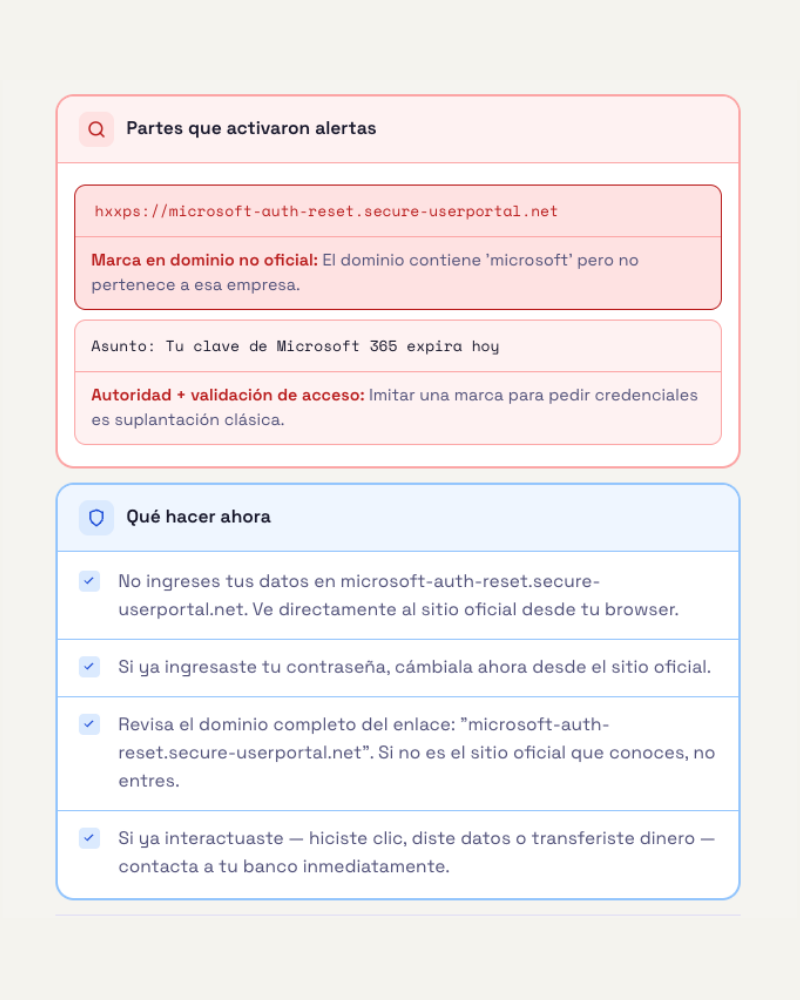

# ¿Qué pasa cuando las reglas no son suficientes?

Si llegaste desde el [social-engineering-scanner](https://github.com/fabianubilla/social-engineering-scanner), ya viste cómo funciona un detector basado en palabras clave — y dónde falla.

Este proyecto intenta ir un paso más allá: combinar reglas con machine learning.

La pregunta que me quedó del scanner era simple:

> ¿qué pasa si en vez de solo buscar palabras, le enseñamos al sistema a reconocer patrones?

NotPhish es el intento de respuesta.

---

## Qué vamos a aprender

- Por qué las reglas solas no bastan
- Cómo funciona un detector con varias capas
- Qué hace un modelo de machine learning aplicado a texto
- Qué es TF-IDF y cómo convierte texto en números
- Por qué combinar reglas y ML es más difícil de lo que parece
- Qué límites siguen existiendo incluso con un sistema más complejo

---

## La interfaz

Está pensada para personas con baja alfabetización digital — especialmente adultos mayores.

No muestra solo "riesgo alto" o "riesgo bajo". Explica qué encontró el análisis y qué hacer con eso, en lenguaje simple.

---

## Capturas

<p align="center">
  
  
  
  
</p>

---

## Cómo usarlo

```bash
git clone https://github.com/fivur-cs/notphish.git
cd notphish
```

**En macOS:**
```bash
pip3 install scikit-learn joblib flask
python3 server.py
```

**En Linux:**
```bash
pip install scikit-learn joblib flask
python server.py
```

Luego abre `index.html` en el navegador.

> Sin Python: abre `index.html` directo. Solo funciona la capa de reglas JS, sin ML.

> En macOS, `pip` y `python` pueden no estar disponibles por defecto. Usa `pip3` y `python3`.

---

## Por qué hacen falta varias capas

En el scanner, la lógica era directa:

```
buscar palabra → sumar punto → mostrar alerta
```

Funciona para aprender. Pero en mensajes reales aparecen problemas que eso no puede resolver:

- una palabra urgente puede estar en un correo legítimo
- un phishing puede no usar palabras obvias
- un enlace puede parecer normal pero apuntar a otro dominio

NotPhish intenta mirar más señales a la vez:

```
reglas JS → modelo ML → sistema híbrido → resultado
```

---

## Cómo funciona por dentro

### Capa 1 — Motor de reglas (`app.js`)

Es la parte más parecida al scanner, pero más sofisticada.

No todas las señales valen lo mismo. Hay señales débiles — que no bastan por sí solas — y señales duras, que siempre activan una alerta porque indican amenaza real.

**Detecta:**
- Dominios que imitan marcas conocidas (`banco-santander-seguro.xyz`)
- URLs acortadas (`bit.ly`) o con formato raro (`hxxps://`)
- Pedidos de OTP — cuando alguien pide el código que llegó a tu celular
- Patrones de CEO Fraud — urgencia + silencio + transferencia
- Señales clásicas de ingeniería social

**Score:** cada señal tiene un peso. El total se capea en 100 — si se activan señales por 270 puntos, el resultado igual es 100. El log técnico muestra los pesos individuales para que se pueda ver qué activó cada cosa.

**Dónde falla:** las reglas siguen sin entender contexto. Un mensaje puede no tener ninguna señal técnica y aun así ser una estafa.

---

### Capa 2 — Modelo de ML (`server.py` + `models/`)

Un clasificador entrenado sobre ~46.000 textos reales — phishing, scam, newsletters, correos legítimos.

**Qué tipo de modelo es:**

SGD (Stochastic Gradient Descent). No es una red neuronal ni un LLM — es un modelo lineal que aprende qué combinaciones de palabras predicen fraude o legitimidad.

**Qué es TF-IDF:**

Para que el modelo procese texto, primero hay que convertirlo en números. TF-IDF hace eso:

- **TF** — qué tan seguido aparece una palabra en este mensaje
- **IDF** — qué tan rara es esa palabra en todos los textos del dataset

Si una palabra aparece mucho en este mensaje pero poco en el dataset general, tiene peso alto. Si aparece en todos lados ("el", "de", "que"), tiene peso bajo.

El modelo también mira pares de palabras ("expira hoy" dice más que "expira" y "hoy" por separado) y variaciones de caracteres ("urgente", "urgentee", "urg3nte").

**Dónde falla:** el modelo fue entrenado principalmente en inglés. Su rendimiento en español de LATAM es menor — tasa de falsos positivos ~9.6% en español versus ~2.3% en inglés. También puede equivocarse con textos cortos o ambiguos.

---

### Capa 3 — Sistema híbrido (`hybrid.js`)

Aquí está el problema más interesante.

Las reglas JS y el modelo ML a veces no están de acuerdo. ¿A cuál hacerle caso? ¿Cuánto puede el ML cambiar el resultado de las reglas?

Si el ML puede modificar libremente el score, puede marcar como sospechoso un mensaje corto y ambiguo solo porque estadísticamente se parece a algo en el dataset.

Para eso existe el **evidence gate** — decide cuánta influencia puede tener el ML según el contexto:

```
blocked  → texto muy corto o sin señales JS → el ML no actúa
partial  → señales de legitimidad → el ML solo puede bajar el score
semantic → no hay señales técnicas → el ML puede subir levemente si está muy seguro
open     → hay señales JS activas → el ML puede subir o bajar libremente
```

No es perfecto. Es una decisión de diseño que tiene sus propios fallos. Pero sin él, el sistema sería menos confiable.

---

## Limitaciones conocidas

- Falsos positivos ~7% en correos de marketing legítimo agresivo
- FPR en español ~9.6% — el ML fue entrenado principalmente en inglés
- No detecta phishing por imagen ni por QR
- No analiza headers del correo
- No funciona en tiempo real — analiza textos pegados manualmente
- El bypass es posible si alguien conoce las reglas

Estas limitaciones no hacen que el proyecto pierda valor — ayudan a entender por qué la detección real de phishing necesita más capas todavía.

---

## Cómo leer el código si eres estudiante

Un orden que ayuda a no perderse:

1. **`config.json`** — solo números, pero muestran qué valores controlan las decisiones del sistema. Buen punto de entrada.
2. **`app.js`** — el motor de reglas. Similar al scanner pero con jerarquía y pesos.
3. **`hybrid.js`** — la lógica híbrida. Conviene leer `computeEvidenceGate()` primero.
4. **`server.py`** — corto. Carga el modelo y responde peticiones desde la interfaz.
5. **`index.html`** — la interfaz. El JS de presentación está al final, separado de la detección.

---

## Estructura

```
notphish/
├── index.html       # Interfaz web
├── app.js           # Motor de reglas JS
├── hybrid.js        # Sistema híbrido — evidence gate y fusión JS + ML
├── hints.js         # Textos educativos por tipo de amenaza
├── server.py        # Servidor Flask para el modelo ML
├── config.json      # Umbrales y parámetros
└── models/
    ├── primary_model_candidate.joblib
    └── subcategory_model_candidate.joblib
```

---

## El siguiente paso

Este proyecto analiza el contenido del mensaje.

Queda pendiente otra capa: los **headers del correo** — los metadatos que revelan por qué servidores pasó el mensaje, si el dominio es real, si las firmas digitales son válidas. Un correo puede tener texto completamente normal y mostrar señales claras de fraude en sus headers.

*[header-analyzer — próximamente]*

---

## Tecnologías

HTML · CSS · JavaScript vanilla · Python · scikit-learn · Flask · TF-IDF · SGD

---

## Sobre este proyecto

Soy estudiante de ingeniería informática y ciberseguridad. A la fecha de este proyecto, mis conocimientos de programación están en una etapa inicial: fundamentos, lógica y exploración práctica.

Este proyecto fue construido usando Claude (Anthropic) como herramienta principal de desarrollo. Claude generó gran parte del código y propuso varias de las decisiones técnicas más complejas del sistema.

Mi rol fue definir qué quería explorar, evaluar esas propuestas, probar el sistema, descartar ideas que no tenían sentido y entender progresivamente cómo funcionaba cada capa: reglas, modelo de machine learning y combinación híbrida.

Lo comparto como parte de un proceso real de aprendizaje. Construir algo concreto, aunque fuera con asistencia fuerte de IA, me ayudó mucho más que solo leer teoría.

Espero que también le sirva a otros estudiantes que estén empezando y quieran entender cómo un detector puede evolucionar desde reglas simples hacia sistemas con más capas.
---

## Licencia

MIT
